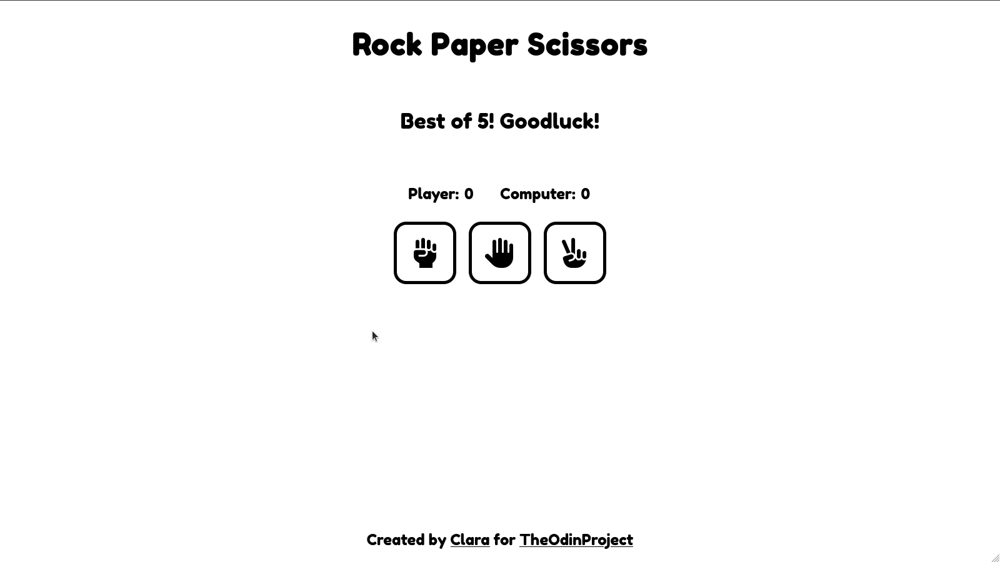
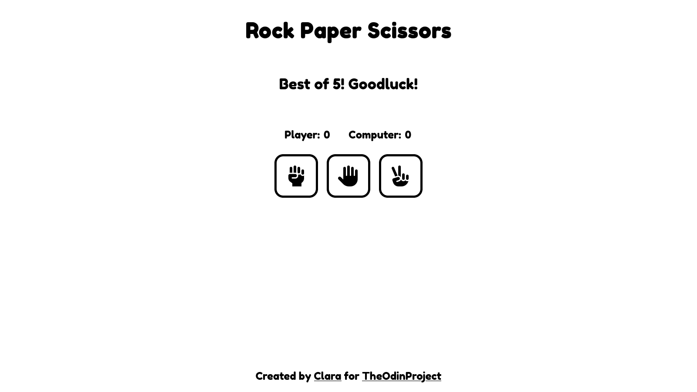

	<h1>Rock Paper Scissors
	 
		
		
		
		 
	</h1>
	<h3><b><a href="https://clarasmyth.github.io/rock-paper-scissors/">View Live Demo</a></b></h3>

## Description

This is a rock paper scissors app created as part of [TheOdinProject](https://www.theodinproject.com) curriculum.

To see the assignment details - [Click Here](https://www.theodinproject.com/lessons/foundations-rock-paper-scissors)

## Built Using

-   HTML5 
-   CSS3 
-   JavaScript 

## Credits

#### Icons

-   [Simple Icons](https://simpleicons.org/)
-   [Font Awesome](https://fontawesome.com/)

## Lessons Learned

I learned how to apply the fundamentals of JavaScript, which I learned through TheOdinProject.
I found JavaScript to be very difficult at first but by working on this project it really helped me wrap my head around the basics of the language.

#### Some of what I learned:

-   Basics ( Variables, Functions , Operators etc )
-   Data Types and Conditionals
-   Arrays and Loops
-   DOM Manipulation and Events
-   How to use the console and debugger to solve problems

## Gallery

#### Home page

